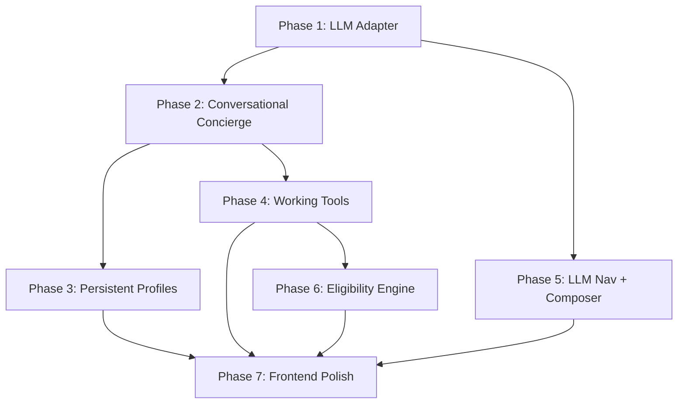

# ET Super Agent – Real AI Agent Workflow Execution Plan

**Date:** 27 March 2026  
**Purpose:** Replace the current dummy/keyword-based agent with a real interactive AI workflow.  
**Constraint:** Zero-budget (Ollama local LLM per `Model_Access_Zero_Budget_Plan.md`)

---

## Current State Audit

Every agent node is currently **keyword-matching + hardcoded templates**. No LLM is used anywhere.

| Component | Current State | Problem |
|---|---|---|
| **ScenarioGuard** | Rejects inputs < 4 words or missing domain keywords | "hi" → clarification wall, no natural greeting |
| **ConciergeAgent** | Sets persona from `riskAppetite` field or keyword check | No conversation, no profiling questions |
| **NavigatorAgent** | Detects 3 gap labels by keyword (`tax`, `debt`, `fd`) | Fixed 3 labels, no reasoning |
| **RecommendationAgent** | Scores 16 KG items by weighted formula | No LLM ranking or explanation |
| **ResponseComposer** | Template: `"Based on your {goal}..."` | Robotic, no natural language |
| **Tools (CTA links)** | All point to `example.et/*` dummy URLs | Nothing opens or works |
| **Session/Auth** | In-memory `Map`, no persistence, no login | Profile lost on restart |
| **Products** | 9 products in mockDB, never shown to user | Eligibility engine unused |

---

## Phase 1 – LLM Adapter Layer (Ollama Integration)

> **Goal:** Pluggable LLM service callable by any graph node.

### [NEW] [llmService.ts](file:///c:/Projects/ET%20Hackathon/et-super-agent/backend/src/services/llmService.ts)
- Create `LLMService` class with `chat(messages, options)` method
- Connects to `http://localhost:11434/api/chat` (Ollama)
- Configurable via env: `LOCAL_MODEL_BASE_URL`, `LOCAL_MODEL_NAME`
- Includes retry + timeout (3s hard limit for demo)
- **Graceful fallback**: if Ollama is down, returns `{ fallback: true, content: "" }` so the existing rule engine continues to work

### [NEW] [llmPrompts.ts](file:///c:/Projects/ET%20Hackathon/et-super-agent/backend/src/services/llmPrompts.ts)
- System prompts for each agent role:
  - `CONCIERGE_SYSTEM_PROMPT` – friendly greeting + profiling
  - `NAVIGATOR_SYSTEM_PROMPT` – gap analysis reasoning
  - `RESPONSE_COMPOSER_PROMPT` – natural language synthesis
- Few-shot examples embedded for consistent output format

### [MODIFY] [.env](file:///c:/Projects/ET%20Hackathon/et-super-agent/backend/.env)
```
MODEL_PROVIDER=local
LOCAL_MODEL_BASE_URL=http://localhost:11434
LOCAL_MODEL_NAME=llama3.2:3b
USE_LLM=true
```

---

## Phase 2 – Conversational Concierge (Interactive Profiling)

> **Goal:** Agent greets naturally, asks profiling questions across turns, builds a profile.

### [MODIFY] [scenarioGuard.ts](file:///c:/Projects/ET%20Hackathon/et-super-agent/backend/src/scenarios/scenarioGuard.ts)
- Accept greetings ("hi", "hello", "hey") as `category: "greeting"` instead of `ambiguous`
- Short inputs (1-3 words) pass through to ConciergeAgent instead of being blocked
- Keep out-of-scope rejection for non-finance topics

### [MODIFY] [graph.ts](file:///c:/Projects/ET%20Hackathon/et-super-agent/backend/src/orchestration/graph.ts)
- **ConciergeAgent rewrite:** Multi-turn profiling flow:
  1. If no profile exists → greet + ask first question (income/age bracket)
  2. If partial profile → ask next missing field (risk appetite → goals → loan status)
  3. If profile complete → hand off to NavigatorAgent
- Uses LLM to generate natural language responses with the user's name
- Stores answers in a new `session.profileAnswers` accumulator
- Profile is "complete" when: `name`, `incomeRange`, `riskPreference`, `topGoal` are filled

### [MODIFY] [types.ts](file:///c:/Projects/ET%20Hackathon/et-super-agent/backend/src/types.ts)
- Add `profileAnswers` map to `UserSession`:
  ```ts
  profileAnswers: Record<string, string>;
  profileComplete: boolean;
  ```

---

## Phase 3 – Persistent Profiles & Login/Recall

> **Goal:** Save user profiles to disk. On return, greet by name and skip profiling.

### [NEW] [profileStore.ts](file:///c:/Projects/ET%20Hackathon/et-super-agent/backend/src/store/profileStore.ts)
- File-based JSON persistence: `data/profiles.json`
- CRUD: `save(profile)`, `getByName(name)`, `getById(id)`, `getAll()`
- Auto-generates UUID for each new user
- Merges new answers into existing profile on re-profiling

### [NEW] [profileRoutes.ts](file:///c:/Projects/ET%20Hackathon/et-super-agent/backend/src/routes/profile.ts)
- `POST /api/profile/login` – lookup by name, return profile + sessionId
- `GET /api/profile/list` – return all saved profiles for quick-select
- `POST /api/profile/save` – persist profile from session data

### [MODIFY] [session.ts](file:///c:/Projects/ET%20Hackathon/et-super-agent/backend/src/routes/session.ts)
- Accept optional `profileId` in session start payload
- If provided, pre-populate session with saved profile data
- ConciergeAgent sees `profileComplete: true` and skips to Navigator

### Frontend changes:
- Add login/profile-select dropdown before chat starts
- "Continue as Guest" option for anonymous profiling
- Show "Welcome back, {name}!" when returning user detected

---

## Phase 4 – Working Interactive Tools

> **Goal:** The 4 tool types (profiler, screener, planner, analyzer) actually work in-chat.

### Tool 1: Risk Profiler
### [NEW] [tools/riskProfiler.ts](file:///c:/Projects/ET%20Hackathon/et-super-agent/backend/src/tools/riskProfiler.ts)
- 5-question quiz: investment horizon, loss tolerance, income stability, savings %, age bracket
- Calculates risk score (1-10) → maps to low/medium/high
- Saves result to profile and session
- Returns: `{ riskScore, riskLabel, explanation, suggestedAllocation }`

### Tool 2: Goal Planner
### [NEW] [tools/goalPlanner.ts](file:///c:/Projects/ET%20Hackathon/et-super-agent/backend/src/tools/goalPlanner.ts)
- Takes: target goal, target amount, time horizon, current savings
- Calculates: monthly SIP needed, recommended asset allocation
- Returns: `{ monthlyTarget, allocation, timeline, recommendations }`

### Tool 3: Fund Screener
### [NEW] [tools/fundScreener.ts](file:///c:/Projects/ET%20Hackathon/et-super-agent/backend/src/tools/fundScreener.ts)
- Filters `seedProducts` (mutual-funds category) by user's risk profile
- Ranks by eligibility match + benefit tags
- Returns: top 5 filtered products with eligibility notes

### Tool 4: Spend Analyzer
### [NEW] [tools/spendAnalyzer.ts](file:///c:/Projects/ET%20Hackathon/et-super-agent/backend/src/tools/spendAnalyzer.ts)
- Takes: monthly income, rent, EMIs, discretionary spend
- Calculates: savings rate, debt-to-income ratio, recommended budgets
- Returns: `{ savingsRate, debtRatio, healthScore, recommendations }`

### [NEW] [routes/tools.ts](file:///c:/Projects/ET%20Hackathon/et-super-agent/backend/src/routes/tools.ts)
- `POST /api/tools/risk-profiler` – run risk questionnaire
- `POST /api/tools/goal-planner` – calculate goal plan
- `POST /api/tools/fund-screener` – filtered fund list
- `POST /api/tools/spend-analyzer` – budget analysis

### Graph Integration:
- When RecommendationAgent selects a "tool" type card, attach `toolId` + `toolAction` to the response
- Frontend detects `toolAction` and opens the corresponding interactive modal

---

## Phase 5 – LLM-Powered Navigation & Response Composition

> **Goal:** NavigatorAgent reasons about gaps; ResponseComposer writes natural language.

### [MODIFY] [navigator.ts](file:///c:/Projects/ET%20Hackathon/et-super-agent/backend/src/orchestration/navigator.ts)
- Add more gap labels: `INSURANCE_GAP`, `INVESTMENT_CONFUSION`, `GENERAL_INQUIRY`
- If LLM available: send user context + message to LLM for gap reasoning
- Fall back to keyword detection if LLM unavailable (existing logic preserved)

### [MODIFY] [graph.ts – responseComposerNode](file:///c:/Projects/ET%20Hackathon/et-super-agent/backend/src/orchestration/graph.ts)
- If LLM available: compose natural assistant message from:
  - User's profile, current gap, recommendations selected, and conversation history
  - Tone: warm, concise, ET editorial voice
- If LLM unavailable: use existing template strings (backward compatible)

---

## Phase 6 – Product Eligibility Engine

> **Goal:** MockDB products are filtered by real eligibility rules and shown to users.

### [NEW] [eligibilityEngine.ts](file:///c:/Projects/ET%20Hackathon/et-super-agent/backend/src/services/eligibilityEngine.ts)
- Takes user profile + product list
- Filters by: `minIncomeBand` ≤ user's income, `riskLevel` ≤ user's appetite, `requiresNoDebt` check
- Returns: eligible products sorted by match score
- Adds `eligibilityStatus: "eligible" | "ineligible"` + `reason` to each product

### [MODIFY] [compare.ts](file:///c:/Projects/ET%20Hackathon/et-super-agent/backend/src/routes/compare.ts)
- Replace hardcoded `mockCardsData`/`mockLoansData` with real `seedProducts` filtered through eligibility engine
- Personalize pros/cons using user profile context

---

## Phase 7 – Frontend Polish & Tool UIs

> **Goal:** Chat feels like a real agent; tools open as interactive modals.

### [MODIFY] [App.tsx](file:///c:/Projects/ET%20Hackathon/et-super-agent/frontend/src/App.tsx)
- **Login/Profile panel:** Quick-select returning user or "Continue as Guest"
- **Tool modals:** When a recommendation card has `toolAction`, clicking CTA opens an in-chat interactive form:
  - Risk Profiler: 5-step slide-based quiz
  - Goal Planner: form with sliders for amount/timeline
  - Fund Screener: filtered product grid
  - Spend Analyzer: income/expense input form
- **Profile badge:** Show current profile summary (name, risk, goal) in chat header
- **Chat QoL:** Markdown rendering in messages, typing indicator improvements, error recovery

---

## Dependency Order



> **Critical path:** Phase 1 → Phase 2 → Phase 3 → Phase 7  
> **Parallel track:** Phase 4, Phase 5, Phase 6 can be built in parallel after Phase 1

---

## Verification Plan

### Per-Phase Testing
| Phase | Test |
|---|---|
| 1 | `curl http://localhost:11434/api/tags` confirms Ollama is running; LLM adapter returns response |
| 2 | "hi" → natural greeting; 3-turn profiling → profile complete |
| 3 | Profile saved to `profiles.json`; re-login loads profile; ConciergeAgent skips profiling |
| 4 | Each tool endpoint returns valid results; frontend modals open and submit |
| 5 | Gap detection uses reasoning; response messages are natural/varied |
| 6 | Products filtered by eligibility; ineligible products show reason |
| 7 | Full demo flow: login → read article → chat → use tool → compare products |

### End-to-End Demo Scenario
1. Open dashboard → select article → type "hi"
2. Agent greets warmly, asks name
3. Answer name → asks income range
4. Complete profiling → agent offers personalized recommendations
5. Click "Start Risk Assessment" → quiz opens → result saved
6. Ask about tax → gap detection → targeted recommendations
7. Click "Deep Compare" → real products filtered by eligibility
8. Close browser → reopen → select same name → agent says "Welcome back!"
